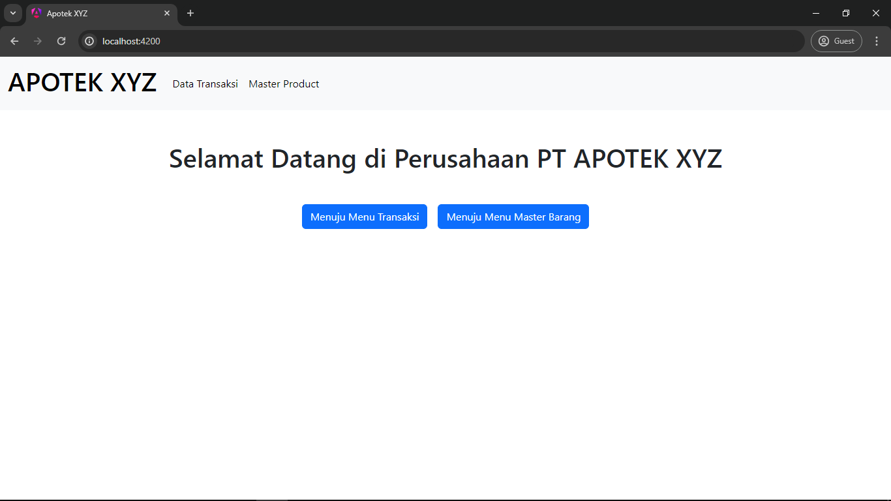
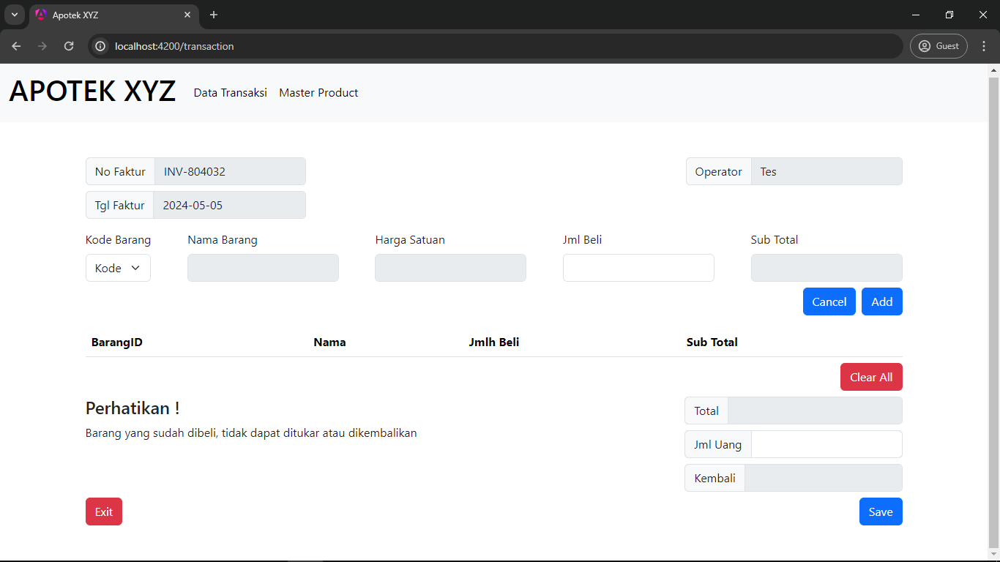
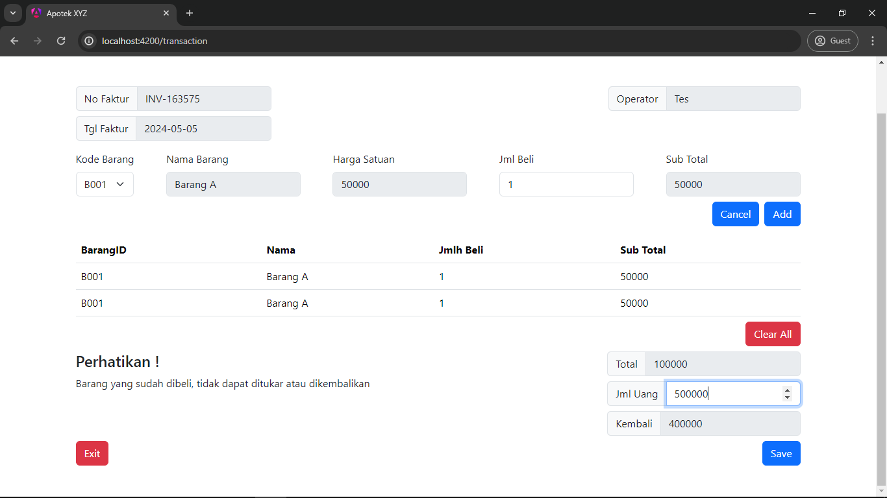
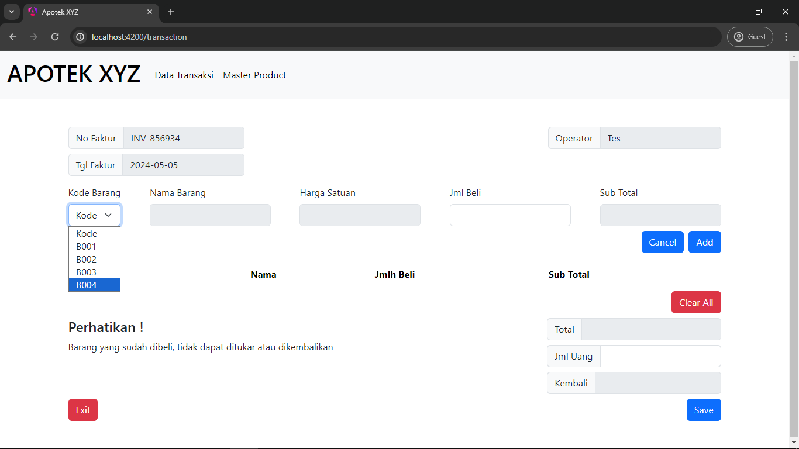
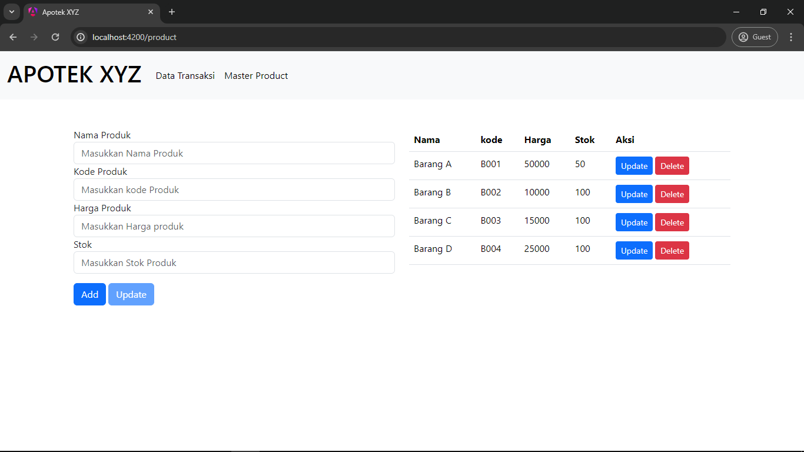

## Apotek XYZ
Aplikasi ini dibangun dengan ASP.NET Core 8.0 sebagai backend dan Angular sebagai frontend. 

### Intruksi 
#### Setup Server 
```bash 
$ cd ariefmahendra.Server/
$ dotnet restore
$ dotnet build
$ dotnet run
```

#### Setup Client
```bash
$ cd ariefmahendra.Client/
$ npm install
$ npm run build
```

### Link Aplikasi
- Server : http://localhost:5048
- Client : http://localhost:4200

### Halaman Utama


### Menu Transaksi


### Membuat Transaksi


### Daftar produk Pada Menu Transaksi


### Menu Master Produk


## Thank You for using Apotek XYZ